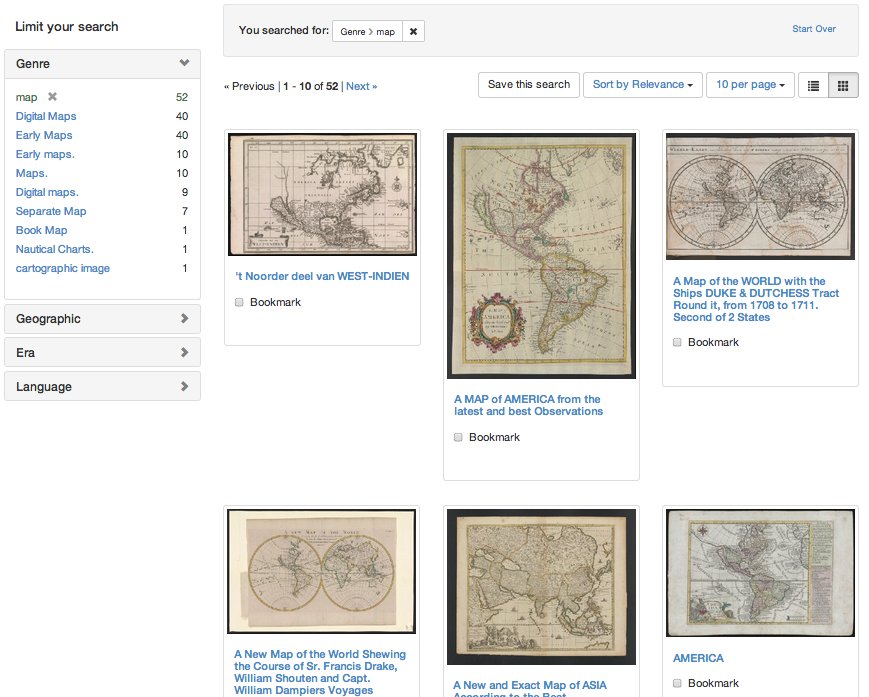

# Blacklight::Gallery

Gallery views for Blacklight search results

## Installation

Add this line to your Blacklight application's Gemfile:

    gem 'blacklight-gallery'

And then execute:

    $ bundle

Or install it yourself as:

    $ gem install blacklight-gallery

## Usage

Run the gallery generator:

    $ rails g blacklight_gallery:install

## Available Views
If you would like to add or remove any particular view either add or remove the following configurations from your Blacklight controller.

### Gallery

    config.view.gallery.partials = [:index_header, :index]

### Masonry

    config.view.masonry.partials = [:index]

### Slideshow

    config.view.slideshow.partials = [:index]

## Screenshot

## Contributing

1. Fork it ( http://github.com/<my-github-username>/blacklight-gallery/fork )
2. Create your feature branch (`git checkout -b my-new-feature`)
3. Commit your changes (`git commit -am 'Add some feature'`)
4. Push to the branch (`git push origin my-new-feature`)
5. Create new Pull Request
